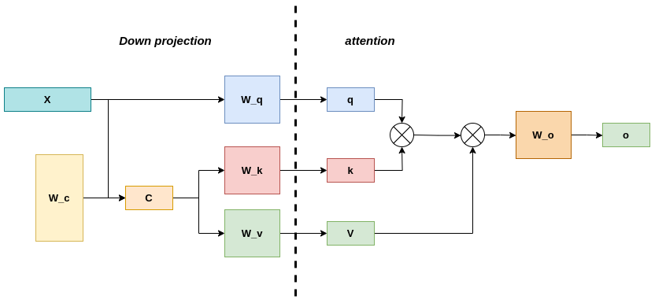

参考博客:[苏剑林：MHA,GQA,MLA](https://kexue.fm/archives/10091)

# DeepSeek-V2

DeepSeek-V2 是幻方研制开源模型，以极低的推理成本而闻名，下面学习一下deepseek到底是如何降低推理成本的

其实主要有两个两大点，分别是MLA和Moe结构，下面分别详细介绍介绍MLA和Moe的关键点

## MLA

这里增加了投影矩阵，在推理阶段，计算量多了，但是有效减少了kv cache的大小

在llama的笔记中，我们有讲到GQA,本质上是希望减少一层间的kv的数量，然后减少kv cache。而MLA是希望通过找到kv 的统一的低维度表示c,来减少kv cache。具体的话先来回顾一下MHA和GQA的结构

首先常规的Attention计算公式是 $o_t = Attention(q_t,k_{ \leq t},v_{ \leq t}) = \frac{\sum_{i<t} exp(q_t k_i^T) v_i}{\sum_{i<t}exp(q_t k_i^T)}$ 其中的t含义为：表示当前第t个要输出的token，而对于i<t的kv，我们可以使用此前的kv cache之前取出，无需重新计算，只需要计算  $k_t,v_t$ 。具备以上条件，即可通过attention的计算得到当前第t个token所需要的 $o_t$ 了。

而MHA的改进，在与采用多个attention头，假设产生第t个token所需要 $ o_t = [o_t^{(1)} , o_t^{(2)},..., o_t^{(h)}]$ 一共有h个注意力头，那么我们就需要对q,k,v也化成h等份，传给不同的注意力头，则每个注意力头的输出 $o_t^{(s)} = Attention(q_t^{(s)},k_{\leq t}^{(s)},v_{\leq t}^{(s)}) = \frac{\sum_{i<t} exp(q_t^{(s)} k_i^{(s) T}) v_i^{(s)}}{ \sum_{i<t}exp(q_t^{(s)} k_i^{(s)})  }$ 其中0<s<h

而GQA则在MHA的基础上进一步减少kv的参数，我们仍然假设$ o_t = [o_t^{(1)} , o_t^{(2)},..., o_t^{(h)}]$ 最终的输出一共有h个，仍然可以认为h个注意力头，但是区别在与，并不是每个头的k,v都是不同的了，而是将h个注意力头，划分成g个组，则一共有 h/g 个组，在同一个组内的注意力头的k,v是共享的，公式表示： $o_t^{(s)} = Attention(q_t^{(s)},k_{\leq t}^{(s)},v_{\leq t}^{(s)}) = \frac{\sum_{i<t} exp(q_t^{(s)} k_i^{(sg/h) T}) v_i^{(sg/h)}}{ \sum_{i<t}exp(q_t^{(s)} k_i^{(sg/h)})  }$ ，其中的除法都是**整除**

### Part1

根据苏神的博客所描述，本质上GQA也是在做投影，通过投影矩阵，找到了k,v的低维度表示c，只存储c，这样在推理阶段只需要cache c即可。为什么说GQA也是在做投影了，我们将k,v拼接在一起，假设输入是x， 则有  $[k_i^{(1)},k_i^{(2)},...,k_i^{(g)},v_i^{(1)},v_i^{(2)},...,v_i^{(g)} ] = x_i[W_k^{(1)},W_k^{(2)},...,W_k^{(g)},W_v^{(1)},W_v^{(2)},...,W_v^{(g)}] $  其中等号左项，我们定义为 $c_i = [k_i^{(1)},k_i^{(2)},...,k_i^{(g)},v_i^{(1)},v_i^{(2)},...,v_i^{(g)} ]$  , 等号右项的权重，我们定义 $W_c = [W_k^{(1)},W_k^{(2)},...,W_k^{(g)},W_v^{(1)},W_v^{(2)},...,W_v^{(g)}]$  则等式可以表示为  $c_i  = x_i W_c，其中 c_i \in \R^{g(d_k+d_v)}, W_c \in \R^{d \times g(d_k+d_v)}，x_i \in \R^d$ 一般来说，我们会希望GQA能够使  $ d_c = g(d_k+d_v) \leq d$，因此可以认为 $c_i$ 是 $x_i$​​ 的一个**低秩投影**  

### Part2

先来看看MLA中单头的例子。事实上，如果我们每次输入都将 $x_i$ 投影到 $c_i$，注意此时的 $c_i$ 并不是上面所说的了，而是通过一个训练得到的 $W_c \in R^{d \times d_c}$ 下投影矩阵将 $x_i$ 投影下来所得。接着，我们同样需要通过 $c_i$  得到对应的 k,v ，同样训练过程中，我们同样训练了 $W_k \in \R^{d_c \times dk},W_v \in \R^{d_c \times d_v}$ ,如下图

在点积注意力中，其完整的公式描述就是 $ q_t k_i^T = x_t W_q (c_i W_k)^T = x_t (W_q W_k^T)c_i^T $ 

而 $ o= softmax(q_t k_i^T) v_i W_o = softmax(q_t k_i^T) c_i W_v W_o$​

观察上面两个公式，如果我们将 $(W_q W_k^T)$ 视为一个投影矩阵，那这样，就可以认为该投影矩阵就是 q的投影矩阵，而 $c_i$ 就是原来的 $k_i$。同理，我们可以将 $(W_v W_o)$ 视为一个投影矩阵，进而可以将 $c_i$ 视为 $v_i$ ，想一想这样是不是很有道理。这样的话，我们就可以在推理阶段只保留 $c_i$ 即可得到注意力分数，这就变相减少了kv cache。但是这样会带来一个问题：在Llama中，我们采用**Rope**对q,v进行了位置编码，如果使用注意力编码，那么点积注意力的公式描述为 $q_t k_i^T = x_t W_q R_t (c_i W_k R_i)^T = x_t (W_q R_{t-i} W_c) c_i^T $ 

因为使用了旋转位置编码，我们不能继续将 $(W_q R_{t-i} W_c)$  视为一个恒不变的矩阵，因为其中掺入了相对位置信息，是变化的。

最后MLA采用的办法就是，在 q,k 的维度上新增 $d_r$ 个维度用来添加Rope, 具体来说就是

$ q_i = [x_i W_{qc}, x_i W_{qr} R_i], k_i = [c_i W_kc,x_i W_{kr} R_i] $

其中 $W_qc 和 W_kc$ 就是上面的  $W_q,W_k$  ,而新增 $W_{qr}, W_{kr}$ 是为了与位置编码相乘，这样我们还是能够只保存 $c_i$​ ，前k个维度可以直接计算，后r个维度进行位置编码计算，最后concat起来分别得到 q,k。

### Part3

最后来讲讲细节

1. 如果将MLA拓展到多头的情况的时候，每个头的所有权重（投影）矩阵是不一样的了， 除了 $W_{kr}$ 这是所有头共享的

2. 在最后的MLA实现中， $q_i = [c_i' W_{qc} W_{kc}, c_i'W_{qr} R_i]$ 其中 $c_i' = x_i W_c'$ ，这里又引入了一个投影矩阵

### Conclusion

总的来说MLA有几个重要的点

1. 引入了很多投影矩阵，因此计算变多了
2. 在推理阶段，只缓存 $ c_i $ ，减少了 cache 的参数，这样变相减少了通讯

##  Moe

waitting to update
