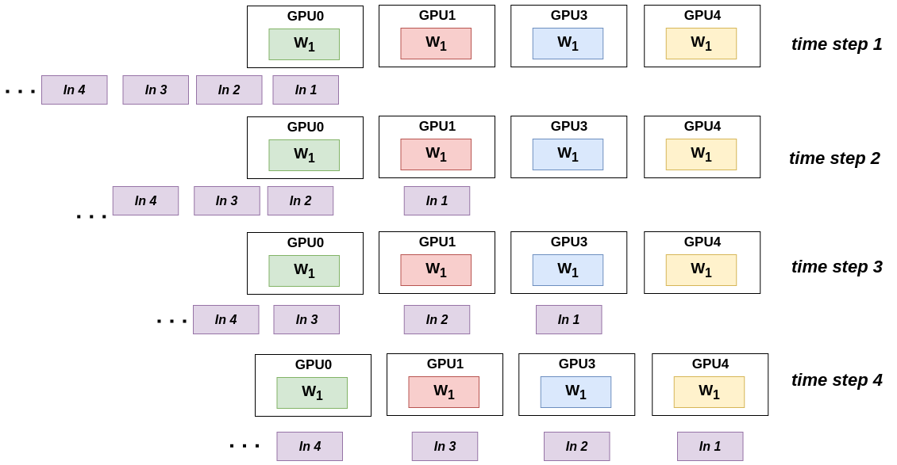

# 三大并行手段

## 数据并行

假设有多张显卡，如果一张显卡能塞下整个模型，那么我们在每个显卡上都保存一个完整的模型，而对输入进行切割，并行切割。

具体地，如果输入的大小为 batch_size， 此时我们可以在batch这个维度对数据进行一次均匀切割。得到每一份的batch为 micro_size 大小的数据,输入到对应的显卡上进行计算，在最后的阶段，进行一次reduce,将micro_size的数据合称batch_size大小的数据

## 张量并行

主要有两种切割方式，对于一个矩阵有按列切分和按行切分

对于ColumnParallel 的切割方式，需要完整的输入，最后将结果concat起来

对于RowParallel 的切割方式， 只需要部分的输入，最后将结果按位相加

通过上面两种对权重矩阵进行切割，可以将切割的部分放置到不同的gpu进行并行计算，提高整体的计算效率

## 流水线并行

这里的流水线并行和cpu的流水线并行基本上没什么区别，我都知道模型都是由一层层网络层构成，后面一层的计算以来前面一层的计算结果，因此可以构造出一个流水线式的计算模式。

具体地，我们可以将一个模型的网络层，按层切分，分成若干个模块，每个模块的参数放到不同的gpu上，流水式地进行计算

